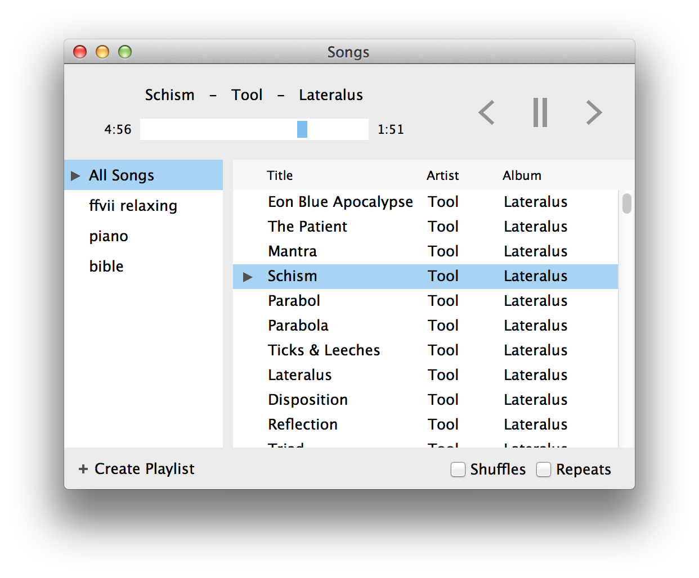

## Songs

*For those of us who are tired of iTunes's crap*

* Current version: **0.1**
* Requires: OS X 10.8 and up
* Download: coming soon

#### What's left for 1.0

- Pick a better (and unique) app name. "Songs" is lame.
- Hope someone makes a really pretty icon for it :)
- Steal Sparkle and the auto-build stuff from Zephyros
- Keyboard shortcuts for *everything*

#### To do after 1.0

- Only display track info parts that exist! ("album" sometimes doesn't, I think)
- Figure out what exactly should happen when you change anything about playlist while it's playing
- Figure out how to get Track info field to display "..." without tightening at every resize
- Make it scriptable maybe?
- Optional Menu bar interface (TunesBar port)

#### Screenshot

#### License

> Released under MIT license.
>
> Copyright (c) 2013 Steven Degutis
>
> Permission is hereby granted, free of charge, to any person obtaining a copy
> of this software and associated documentation files (the "Software"), to deal
> in the Software without restriction, including without limitation the rights
> to use, copy, modify, merge, publish, distribute, sublicense, and/or sell
> copies of the Software, and to permit persons to whom the Software is
> furnished to do so, subject to the following conditions:
>
> The above copyright notice and this permission notice shall be included in
> all copies or substantial portions of the Software.
>
> THE SOFTWARE IS PROVIDED "AS IS", WITHOUT WARRANTY OF ANY KIND, EXPRESS OR
> IMPLIED, INCLUDING BUT NOT LIMITED TO THE WARRANTIES OF MERCHANTABILITY,
> FITNESS FOR A PARTICULAR PURPOSE AND NONINFRINGEMENT. IN NO EVENT SHALL THE
> AUTHORS OR COPYRIGHT HOLDERS BE LIABLE FOR ANY CLAIM, DAMAGES OR OTHER
> LIABILITY, WHETHER IN AN ACTION OF CONTRACT, TORT OR OTHERWISE, ARISING FROM,
> OUT OF OR IN CONNECTION WITH THE SOFTWARE OR THE USE OR OTHER DEALINGS IN
> THE SOFTWARE.
